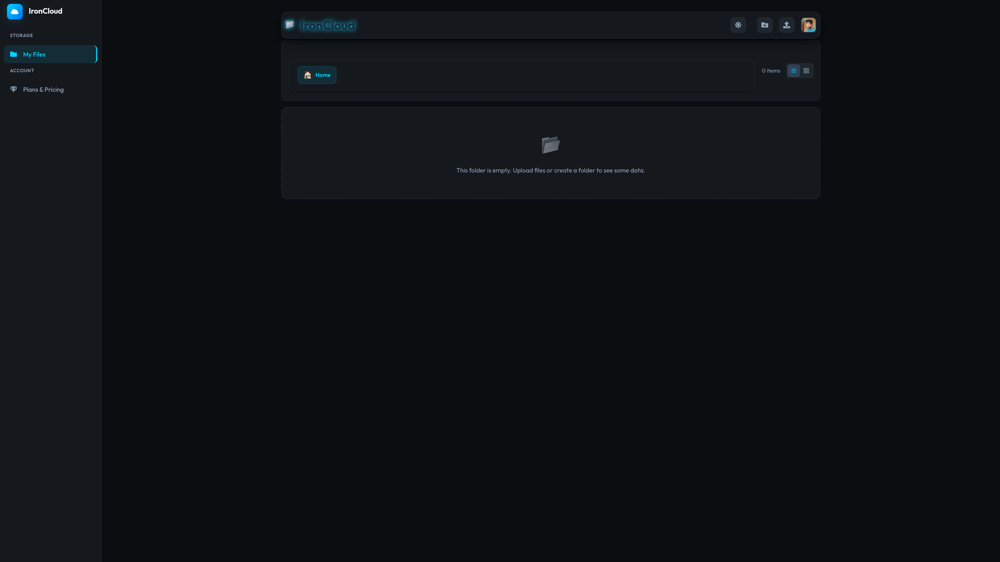
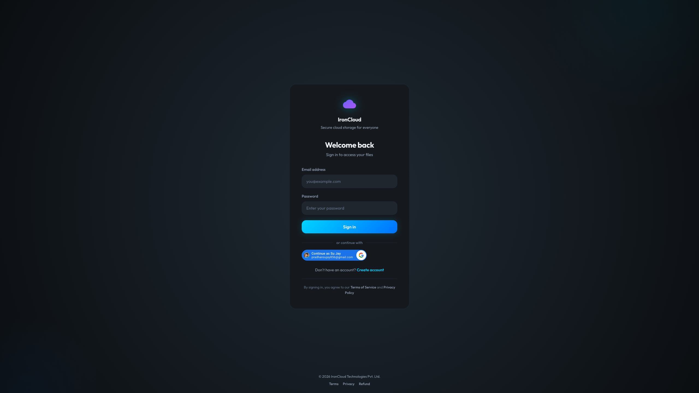

# IronCloud - Client Application

Welcome to the client-side repository for **IronCloud**, a robust and modern cloud storage solution designed to provide secure and efficient file management.

## 🚀 Project Overview

IronCloud is a web-based application that allows users to store, organize, and manage their files in the cloud. Built with performance and user experience in mind, it features a responsive interface, secure authentication, and powerful directory management capabilities.

## ✨ Key Features

- **User Authentication**: Secure login and registration powered by Google OAuth and custom JWT authentication.
- **Directory Management**: Browse, organize, and manage files and folders seamlessly.
- **Interactive UI**: A modern, responsive design with glassmorphism effects and smooth transitions.
- **Subscription Plans**: View and subscribe to different storage tiers.
- **Admin Dashboard**: Comprehensive admin tools for managing users and plans.
- **Legal Compliance**: dedicated pages for Terms of Service, Privacy Policy, and Refund Policy.

## 🛠️ Tech Stack

This project is built using the following technologies:

- **Frontend Framework**: [React](https://react.dev/)
- **Build Tool**: [Vite](https://vitejs.dev/)
- **Routing**: [React Router Dom](https://reactrouter.com/)
- **State Management**: React Context API
- **HTTP Client**: [Axios](https://axios-http.com/)
- **Styling**: CSS Modules, Vanilla CSS
- **Icons**: [React Icons](https://react-icons.github.io/react-icons/)

## � Folder Structure

```
client/
├── public/
├── src/
│   ├── apis/
│   ├── assets/
│   ├── authProvider/
│   ├── components/
│   │   ├── Breadcrumb.jsx
│   │   ├── ContextMenu.jsx
│   │   ├── CreateDirectoryModal.jsx
│   │   ├── DetailsModel.jsx
│   │   ├── DirectoryHeader.jsx
│   │   ├── DirectoryItem.jsx
│   │   ├── DirectoryList.jsx
│   │   ├── Footer.jsx
│   │   ├── Layout.jsx
│   │   ├── RenameModal.jsx
│   │   ├── Sidebar.jsx
│   │   ├── StorageInfo.jsx
│   │   ├── ThemeProvider.jsx
│   │   ├── ThemeToggle.jsx
│   │   └── Toast.jsx
│   ├── hooks/
│   ├── pages/
│   │   ├── PrivacyPolicy.jsx
│   │   ├── RefundPolicy.jsx
│   │   └── TermsOfService.jsx
│   ├── utils/
│   ├── Admin.jsx
│   ├── AdminPlan.jsx
│   ├── App.jsx
│   ├── DirectoryView.jsx
│   ├── Login.jsx
│   ├── PaymentSuccess.jsx
│   ├── Plan.jsx
│   ├── Register.jsx
│   ├── main.jsx
│   └── index.css
├── .env
├── index.html
├── package.json
└── vite.config.js
```

## �📸 Screenshots

<!-- 
    Add your application screenshots here. 
    You can drag and drop images into this folder (e.g., /assets/screenshots) 
    and link them using standard Markdown syntax: 
    
-->

### Dashboard


### Login Screen


## ⚙️ Installation & Setup

Follow these steps to get the project running locally on your machine.

### Prerequisites

- [Node.js](https://nodejs.org/) (v16 or higher recommended)
- [npm](https://www.npmjs.com/) or [yarn](https://yarnpkg.com/)

### Steps

1. **Clone the repository**
   ```bash
   git clone <repository-url>
   cd storage_app/client
   ```

2. **Install dependencies**
   ```bash
   npm install
   ```

3. **Environment Configuration**
   Create a `.env` file in the root directory and add your server URL:
   ```env
   VITE_SERVER_URL=http://localhost:5000
   ```

4. **Run the development server**
   ```bash
   npm run dev
   ```

5. **Open the app**
   Visit `http://localhost:5173` in your browser.

## 📜 Scripts

- `npm run dev`: Starts the development server.
- `npm run build`: Builds the app for production.
- `npm run preview`: Previews the production build locally.
- `npm run lint`: Runs ESLint to check for code quality issues.

## 📄 License

This project is licensed under the MIT License.
